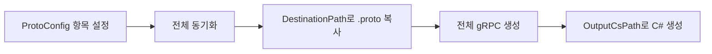

## ProtoBuilder (Unity gRPC/protoc Helper)

간단한 유니티 에디터 툴로, 서버의 .proto를 동기화하고 gRPC C# 코드를 생성합니다.

### 주요 기능
- ProtoConfig 항목(여러 개) 기반으로 일괄 처리
- 서버 .proto → 클라이언트 대상 폴더로 폴더 구조 유지 복사
- protoc + grpc_csharp_plugin으로 C# 코드 생성
- well-known types(google/protobuf/*.proto) 자동 include 처리
- 인스펙터에서 폴더 선택 버튼 제공

### 요구 사항
- Unity 2021+ 권장
- NuGet for Unity로 다음 패키지 설치: Google.Protobuf, Grpc.Tools, Grpc.Net.Client, System.IO.Pipelines

### 사용 방법
1) 메뉴로 기본 설정 생성
   - 에디터툴/ProtoBuilder/Create Default ProtoConfig
2) ProtoConfig 에셋에서 항목(이름, 원본/대상/출력 경로) 설정
   - 경로는 절대/상대 모두 가능 (상대는 프로젝트 루트 기준)
   - 인스펙터의 ... 버튼으로 폴더 선택 가능
3) 실행
   - 에디터툴/ProtoBuilder/Generate Client Protos C# (동기화 → 생성 순서)
   - 또는 인스펙터 하단 유틸 버튼 사용


### 예시 프로젝트 구조
```text
Root/
├─ Client/                     # Unity 프로젝트 루트
│  └─ Assets/
│     ├─ Protos/
│     │  ├─ Auth/             # 동기화된 인증서버 .proto
│     │  └─ Game/             # 동기화된 게임서버 .proto
│     └─ Scripts/
│        └─ Packet/
│           ├─ Auth/          # 생성된 C# (Auth)
│           └─ Game/          # 생성된 C# (Game)
└─ Server/
   ├─ Auth/
   │  └─ Protos/              # 인증서버 .proto 원본
   └─ GameServer/
      └─ Protos/              # 게임서버 .proto 원본
```

### ProtoConfig 예시 입력


```text
항목 1 (Auth)
- Name: Auth
- SourcePath: ../Server/Auth/Protos
- DestinationPath: Assets/Protos/Auth
- OutputCsPath: Assets/Scripts/Packet/Auth

항목 2 (Game)
- Name: Game
- SourcePath: ../Server/GameServer/Protos
- DestinationPath: Assets/Protos/Game
- OutputCsPath: Assets/Scripts/Packet/Game
```

### 경로 규칙
- SourcePath: 서버 .proto 루트
- DestinationPath: 클라이언트에서 .proto를 둘 폴더 (예: Assets/Protos/Auth)
- OutputCsPath: 생성된 C# 산출물 폴더 (예: Assets/Scripts/Packet/Auth)

### 실행 후 결과 예시
- 전체 동기화: Server의 .proto가 Client/Assets/Protos 하위(Auth, Game)로 복사
- 전체 gRPC 생성: Client/Assets/Scripts/Packet 하위(Auth, Game)에 C# 파일 생성

### 동작 플로우(개요)


### 메뉴 요약
| 메뉴 | 기능 |
| --- | --- |
| 에디터툴/ProtoBuilder/Create Default ProtoConfig | 기본 설정 에셋 생성(중복 생성 방지) |
| 에디터툴/ProtoBuilder/Generate Client Protos C# | 전체 동기화 후 전체 gRPC 생성 |

### well-known types 처리
- 다음 경로들을 자동으로 include로 추가합니다(존재하는 것만 적용):
  - Packages/Grpc.Tools.<버전>/tools/include
  - %USERPROFILE%/.nuget/packages/grpc.tools/<버전>/build/native/include

### 트러블슈팅
- timestamp.proto not found: 위 include 경로가 실제로 존재하는지 확인하세요.
- 게임 C#이 Auth 폴더에도 생성됨: 두 항목의 SourcePath가 동일하면 DestinationPath 둘 다로 복사됩니다. 각 서버의 고유 루트를 지정하세요.

### 라이선스
- 본 폴더의 LICENSE 파일(예: MIT)을 참조하세요.