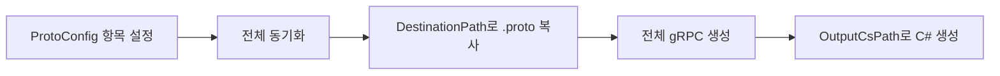

# ProtoBuilder (Unity gRPC/protoc Helper)

Unity에서 gRPC 서버와의 .proto 파일 동기화 및 C# 코드 생성을 자동화하는 에디터 툴입니다.

## Features

- **서버 .proto 파일 자동 동기화**
- **gRPC C# 클라이언트 코드 일괄 생성**
- **멀티 서버 환경 지원** (Auth, Game 등)

> **상세한 사용법과 Unity gRPC 구성**: [Unity에서 gRPC 사용하기 4 - 클라이언트 구성과 코드 생성](https://lmspace7.github.io/posts/grpc-4/)

---

## Installation

Unity Package Manager에서 git URL 추가:

```text
https://github.com/lmspace7/ProtoBuilderForUnity.git
```

---

## Prerequisites

- **protoc.exe**가 시스템 PATH에 있거나 Grpc.Tools 패키지를 통해 설치되어야 함
- **서버측 .proto 파일**에 접근 가능한 환경
- **서버 .proto 파일 경로**를 미리 파악해두세요

---

## Requirements

- **Unity 2021+** 권장
- **Windows 환경** (현재 Windows에서만 테스트됨 - macOS/Linux 지원 여부 미확인)
- **NuGet for Unity** 설치: [NuGetForUnity](https://github.com/GlitchEnzo/NuGetForUnity)
  - **Google.Protobuf**
  - **Grpc.Tools**
  - **Grpc.Net.Client**
  - **System.IO.Pipelines**

---

## Quick Start

### 1. 설정 파일 생성

`에디터툴 > ProtoBuilder > Create Default ProtoConfig`

### 2. 서버 연결 설정

- 생성된 **ProtoConfig** 에셋 선택
- 각 서버별로 **항목 추가** (Auth, Game 등)
- **경로 설정**: 서버 .proto 위치 → Unity 내 복사 위치 → C# 생성 위치
- 경로는 **절대/상대** 모두 가능 (상대는 프로젝트 루트 기준)
- 인스펙터의 **...** 버튼으로 폴더 선택 가능

### 3. 코드 생성 실행

- `에디터툴 > ProtoBuilder > Generate Client Protos C#` (동기화 → 생성 순서)
- 또는 **인스펙터 하단 유틸 버튼** 사용

---

## Menu Reference

| 메뉴 | 기능 |
| --- | --- |
| `에디터툴 > ProtoBuilder > Create Default ProtoConfig` | 기본 설정 에셋 생성(중복 생성 방지) |
| `에디터툴 > ProtoBuilder > Generate Client Protos C#` | 전체 동기화 후 전체 gRPC 생성 |

---

## Project Structure Example

```text
Root/
├─ Client/                     # Unity 프로젝트 루트
│  └─ Assets/
│     ├─ Protos/
│     │  ├─ Auth/             # 동기화된 인증서버 .proto
│     │  └─ Game/             # 동기화된 게임서버 .proto
│     └─ Scripts/
│        └─ Packet/
│           ├─ Auth/          # 생성된 C# (Auth)
│           └─ Game/          # 생성된 C# (Game)
└─ Server/
   ├─ Auth/
   │  └─ Protos/              # 인증서버 .proto 원본
   └─ GameServer/
      └─ Protos/              # 게임서버 .proto 원본
```

---

## Configuration

### ProtoConfig 설정 예시


```text
항목 1 (Auth)
- Name: Auth
- SourcePath: ../Server/Auth/Protos
- DestinationPath: Assets/Protos/Auth
- OutputCsPath: Assets/Scripts/Packet/Auth

항목 2 (Game)
- Name: Game
- SourcePath: ../Server/GameServer/Protos
- DestinationPath: Assets/Protos/Game
- OutputCsPath: Assets/Scripts/Packet/Game
```

### Path Rules

- **SourcePath**: 서버 .proto 루트
- **DestinationPath**: 클라이언트에서 .proto를 둘 폴더 (예: `Assets/Protos/Auth`)
- **OutputCsPath**: 생성된 C# 산출물 폴더 (예: `Assets/Scripts/Packet/Auth`)

---

## Execution Results

- **전체 동기화**: Server의 .proto가 `Client/Assets/Protos` 하위(Auth, Game)로 복사
- **전체 gRPC 생성**: `Client/Assets/Scripts/Packet` 하위(Auth, Game)에 C# 파일 생성

---

## Workflow



---

## Well-Known Types Handling

다음 경로들을 자동으로 include로 추가합니다(존재하는 것만 적용):

- `Packages/Grpc.Tools.<버전>/tools/include`
- `%USERPROFILE%/.nuget/packages/grpc.tools/<버전>/build/native/include`

---

## Troubleshooting

- **timestamp.proto not found**: 위 include 경로가 실제로 존재하는지 확인하세요.
- **게임 C#이 Auth 폴더에도 생성됨**: 두 항목의 SourcePath가 동일하면 DestinationPath 둘 다로 복사됩니다. 각 서버의 고유 루트를 지정하세요.
- **macOS/Linux**: 현재 Windows 환경에서만 테스트되었습니다. 다른 OS에서의 호환성은 보장되지 않습니다.

---

## License

MIT License
